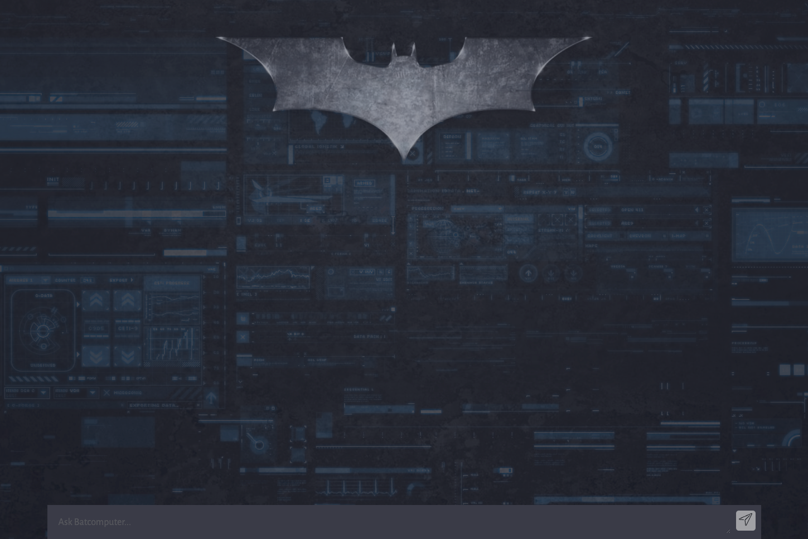
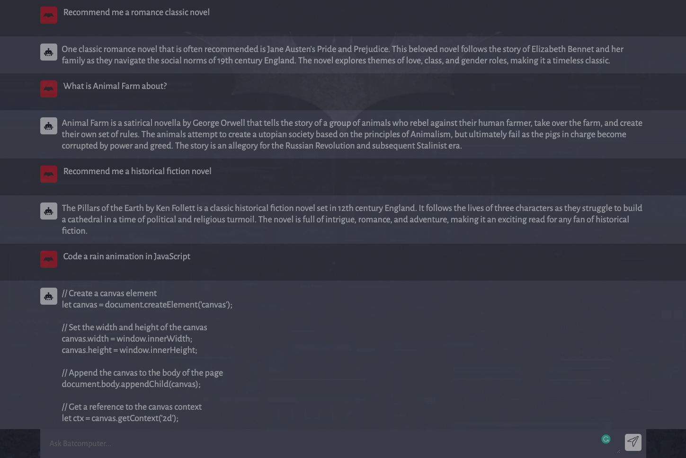

# BATCOMPUTER

## About

**Batcomputer** is an AI web application that allows users to type in prompts (questions or commands) and receive responses from an AI. The application utilizes OpenAI's Davinci model to process and generate natural language.

This project expands Adrian Hajdin's [Codex](https://github.com/adrianhajdin/project_openai_codex).

## Demo

Check out Batcomputer in action: [batcomputer.vercel.app](https://batcomputer.vercel.app)

## Credit

[Codex](https://github.com/adrianhajdin/project_openai_codex) by Adrian Hajdin
